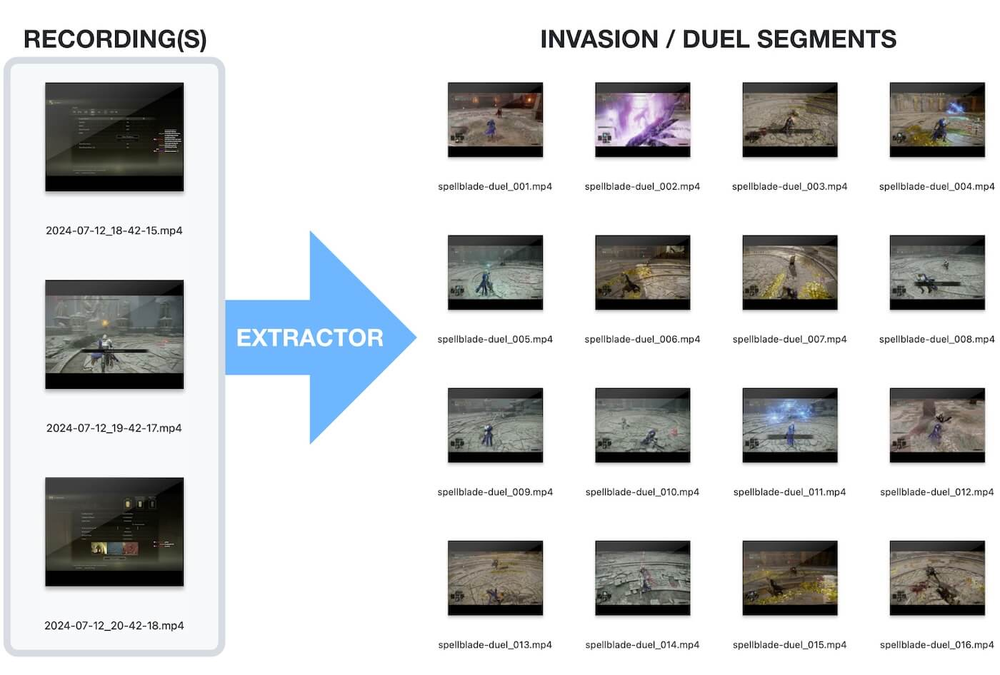

# Elden Ring Invasion Extractor
This Ruby gem is designed to automatically detect the start and end of invasions in Elden Ring gameplay footage. It's a time-saving tool for content creators who stream Elden Ring and want to efficiently edit their recordings.

## Background
As a hobby streamer, I often record entire streaming sessions in one go. Editing these long recordings to extract invasion segments was a time-consuming process that involved skimming through hours of footage. This tool is my contribution to the Souls community, aimed at helping fellow content creators streamline their editing process.

## How It Works
[Short video demo](https://www.youtube.com/watch?v=-G9ARNrhMOI)

The tool uses Optical Character Recognition (OCR) to detect invasion start and end points in your gameplay footage. It can handle multiple video files and even detect invasions that span across two files, automatically cutting and combining them correctly.



For a detailed look at the development process, you can watch this [YouTube summary](https://www.youtube.com/watch?v=ZAWuatbjIuc) of the initial creation stream.

## Important things to note:
- The tool reads the game text to detect invasions. If you open the PSN quick menu or any other overlay that covers the game text, the tool might not be able to detect certain invasions correctly.
- At this stage **I'm still writing and re-writing the code to test different approaches. The tool is not perfect and might not work for all invasions. If you happen to have any issues, please open an issue on this repository.**

## Planned Features
- [x] Automatically detect invasion start and end points in Elden Ring gameplay footage
- [x] Support for Arena Duels
- [ ] Multi language support (Right now only English is supported)
- [ ] Support for Taunters Tongue Runs (When you get invaded until the invader dies)
- [ ] Windows & Linux Support. (Right now this gem has only been tested on macOS)

If you have any feature requests, please [open an issue](https://github.com/bladeofmaya/invasion_extractor/issues) on this repository.

## Usage
This repository comes with a executable binary `invasion_extractor` file that you can use to test it on your own footage. For now follow these steps.

```
# clone the git repository
git clone https://github.com/bladeofmaya/invasion_extractor.git invasion_extractor

# Change working directory
cd invasion_extractor

# make sure you have ffmpeg & tesseract installed
brew install ffmpeg
brew install tesseract

# generate the clips
bin/invasion_extractor --prefix pyro-invasion --outdir /Users/username/Desktop/pyro-clips video1.mp4 video2.mp4

# Final output in /Users/username/Desktop/pyro-clips::
pyro-invasion-001.mp4
pyro-invasion-002.mp4
pyro-invasion-003.mp4
pyro-invasion-004.mp4
etc...

```

NOTE: If you have OBS setup to split your recordings into 60-minute segments, you can pass multiple video files to the tool. It will automatically detect invasions that span across two files and combine them correctly. Make sure to pass in the videos in the correct order.

## Supported Platforms
This tool should work on Windows, Linux and macOS. Right now the tool has only been tested on macOS. If you have any issues on Windows or Linux, please [open an issue](https://github.com/bladeofmaya/invasion_extractor/issues) on this repository.

## Testing Environment
This tool has been tested with the following video files:
- 2560x1440 resolution recordings at 60fps
- Keyframe interval of 1 second
- Apple VT HEVC Hardware Encoder
- 60-minute video segments

## Support
If you find this tool helpful and want to support my work, you can donate via [Ko-fi](https://ko-fi.com/bladeofmaya).

## Contributing
Contributions are welcome! If you're interested in improving this tool or adding support for other platforms, please feel free to submit a pull request or open an issue.

## License
MIT-LICENSE
