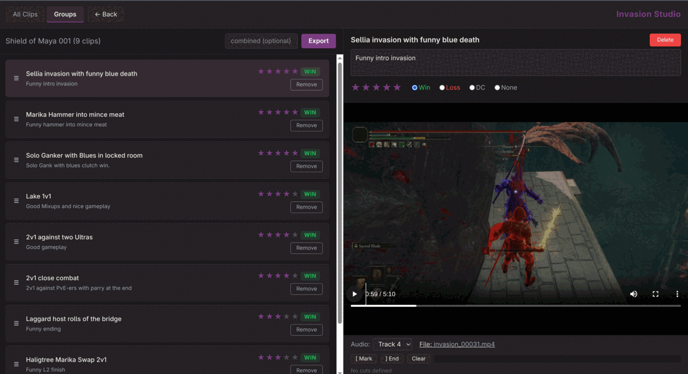

# Elden Ring Invasion Extractor

Automatically detect and extract invasion clips from your Elden Ring gameplay footage. This Ruby gem scans your recordings using OCR (Optical Character Recognition) to find invasion start/end points and cuts them into separate video files — perfect for content creators who want to streamline their editing workflow.

[📺 Watch the demo](https://www.youtube.com/watch?v=-G9ARNrhMOI)


---

## Quick Start

### Prerequisites

Make sure you have **ffmpeg** and **tesseract** installed:

```bash
# macOS
brew install ffmpeg tesseract

# Ubuntu/Debian
sudo apt-get install ffmpeg tesseract-ocr

# Arch Linux
sudo pacman -S ffmpeg tesseract tesseract-data-eng
```

### Installation

```bash
git clone https://github.com/bladeofmaya/invasion_extractor.git
cd invasion_extractor
bundle install
```

### Basic Usage

```bash
# Extract invasions from a single video
bin/invasion_extractor video.mp4

# Extract with custom prefix and output directory
bin/invasion_extractor --prefix ps-daggers-tt-04 --outdir ~/Videos/ER/clips ~/Videos/Capture/*.mp4

# Scan only - find invasions without extracting
bin/invasion_extractor scan ~/Videos/Capture/*.mp4
```

**Output:**
```
~/Videos/ER/clips/
├── ps-daggers-tt-04_00001.mp4
├── ps-daggers-tt-04_00002.mp4
├── ps-daggers-tt-04_00003.mp4
└── ...
```

**Pro tip:** If OBS splits your recordings into segments (e.g., 60-minute chunks), pass all files in order. The tool detects invasions that span across files and combines them automatically.

---

## What It Does

This tool reads on-screen text to detect:
- **Invasion Start**: "Defeat [Name], Host of Fingers" / "Commencing combat"
- **Invasion End**: "Returning to your world" / "Combat ends"

It then automatically cuts your video into individual invasion clips, adding a 10-second buffer before the start and 7.5 seconds after the end so you don't miss any action.

---

## Invasion Studio (WebUI)

After extracting clips, organize, review, and export them with the built-in browser-based studio.



### Features

- **Browse & Organize** — View all clips with titles, notes, star ratings, and win/loss/dc tags
- **Groups** — Create groups to organize invasions by theme, build, or session
- **Video Preview** — Watch clips directly in the browser with audio track switching
- **Cut Editor** — Mark start/end cut points and export only the best moments
- **Export** — Export groups as a single spliced video with a Kdenlive timeline project

### How to Run

```bash
# Start the studio from your clips folder
bin/invasion_extractor webui ~/Videos/ER/clips

# Start on a custom port
bin/invasion_extractor webui -p 8080 ~/Videos/ER/clips
```

Then open `http://localhost:4567` (or your custom port) in your browser.

---

## Full CLI Reference

### Command Structure

```
bin/invasion_extractor [COMMAND] [OPTIONS] [VIDEO_FILES...]
```

### Commands

| Command | Description |
|---------|-------------|
| `extract` | Extract invasion clips (default) |
| `scan` | Scan videos and show timestamps only |
| `webui` | Start the Invasion Studio browser interface |
| `export-kdenlive` | Export clips to a Kdenlive timeline |
| `concat` | Concatenate clips into a single video |

### Complete Flag Reference

| Flag | Default | Description |
|------|---------|-------------|
| `-h, --help` | — | Show help message and exit |
| `-v, --version` | — | Show version and exit |
| `-d, --debug` | Off | Print debug output and write frame text to YAML |
| `-q, --quiet` | Off | Suppress all non-error output |
| `-p, --prefix PREFIX` | `invasion` | Prefix for output clip filenames |
| `-o, --outdir DIRECTORY` | `./invasion_clips` | Output directory for extracted clips |
| `--fps RATE` | `2` | Frames per second to extract for OCR |
| `--no-cache` | Off | Skip OCR cache and force re-processing |
| `--pad-start SECONDS` | `10.0` | Seconds to include before invasion start |
| `--pad-end SECONDS` | `7.5` | Seconds to include after invasion end |
| `--continue-on-error` | Off | Continue processing remaining videos if one fails |

### Flag Details

**`--fps RATE`** — Controls how many frames per second are extracted from the video for OCR. The default `2` means one frame every 0.5 seconds. Increasing to `4` or `5` improves detection accuracy for very short invasions but increases processing time linearly. Decreasing to `1` speeds things up but may miss brief text flashes.

**`--debug`** — Enables two things: (1) prints every matched start/end frame with its exact timestamp and raw OCR text so you can inspect why an invasion was missed, and (2) writes a `<video_hash>.debug.yml` file containing every extracted frame's timestamp and detected text.

---

## Usage Examples

### Basic Extraction

```bash
# Extract from a single video
bin/invasion_extractor video.mp4

# Extract from multiple videos with prefix
bin/invasion_extractor --prefix my-invasions ~/Videos/Capture/*.mp4

# Specify output directory
bin/invasion_extractor -o ~/Desktop/clips ~/Videos/Capture/*.mp4
```

### Scan Mode (Preview Invasions)

```bash
# Scan only - shows timestamps without extracting
bin/invasion_extractor scan ~/Videos/Capture/*.mp4

# Output:
# Detected Invasions:
#   [1] 00:05:30.000 → 00:08:45.500
#       File: 2024-01-15_18-39-00.mp4
#   [2] 00:22:15.000 → 00:25:30.250
#       Cross-file: 2024-01-15_18-39-00.mp4 → 2024-01-15_19-39-00.mp4
#
# Total: 2 invasion(s) detected
```

### Debug Mode

```bash
# See exactly what OCR detected at every timestamp
bin/invasion_extractor -d ~/Videos/Capture/*.mp4

# Output includes:
#   [START] 00:01:23.500 => "Defeat the Host of Fingers"
#   [END]   00:02:45.000 => "Returning to your world"
#
# Plus a .debug.yml file with every frame's text
```

### Cache Management

OCR results are cached automatically in `~/.invasion_extractor/cache/`. To force re-processing:

```bash
# Skip cache for this run
bin/invasion_extractor --no-cache ~/Videos/Capture/*.mp4

# Clear cache manually
rm -rf ~/.invasion_extractor/cache/*.yml
```

---

## Requirements & Compatibility

| Requirement | Details |
|------------|---------|
| **Resolution** | Optimized for 1440p (2560×1440), works at 1080p and 720p |
| **Framerate** | 30fps or 60fps |
| **Platform** | macOS (tested), Linux & Windows should work |
| **Language** | English only (for now) |
| **Ruby** | 3.3+ |

### Known Limitations

- **UI Overlays**: PSN quick menu or other overlays covering game text can cause missed detections
- **Text Position**: Invasion text must be visible — if you're in a menu when it appears, detection may fail
- **Performance**: Processing a 60-minute video takes ~30-60 seconds on CPU

---

## Architecture

```
lib/invasion_extractor/
├── invasion_extractor.rb    # Main entry point, dependency checks
├── cli.rb                   # CLI orchestrator (parses args, dispatches commands)
├── commands/
│   ├── base.rb              # Abstract command base class
│   └── extract.rb           # Extract/scan command implementation
├── engine.rb                # High-level orchestration with 3-stage pipeline
├── video.rb                 # Video file representation & YAML caching
├── ocr_worker.rb            # Frame extraction (rawvideo pipe) and OCR processing
├── frame.rb                 # Data structure for frame metadata
├── scanner.rb               # Pattern matching for invasion detection
├── clip.rb                  # Video clip generation (ffmpeg)
├── time_helper.rb           # Time manipulation utilities
├── version.rb               # Version constant
└── ocr/
    ├── provider.rb          # Abstract OCR interface
    └── tesseract_provider.rb# Tesseract OCR implementation (default)
```

### Data Flow

```
Video Files → OCRWorker → Frames → Scanner → Segments → Clip → Output Files
     ↓            ↓          ↓         ↓          ↓       ↓
   ffmpeg    rawvideo    Cache    Regex     Struct   ffmpeg
   pipe        pipe     (YAML)
```

---

## Development

### Running Tests

```bash
bundle exec rake test
```

All tests run against sample video files in `test/samples/`.

### Using the OCR Provider Directly

```ruby
provider = InvasionExtractor::OCR::TesseractProvider.new
result = provider.recognize('test/samples/invasion_start.jpg')
puts result
```

---

## Contributing

Contributions welcome! Areas that need help:

- **Windows/Linux testing**: Currently only tested on macOS
- **Multi-language support**: Japanese, German, French, etc.
- **OCR accuracy**: Tuning crop regions for better text detection

Open an issue or submit a PR at [github.com/bladeofmaya/invasion_extractor](https://github.com/bladeofmaya/invasion_extractor).

---

## Support

If this tool saves you time, consider supporting development:

[](https://ko-fi.com/bladeofmaya)

## License

MIT License - see [MIT-LICENSE](MIT-LICENSE)

---

*Happy invading! ⚔️*

*For a behind-the-scenes look at how this was built, check out the [creation stream summary](https://www.youtube.com/watch?v=ZAWuatbjIuc).*
