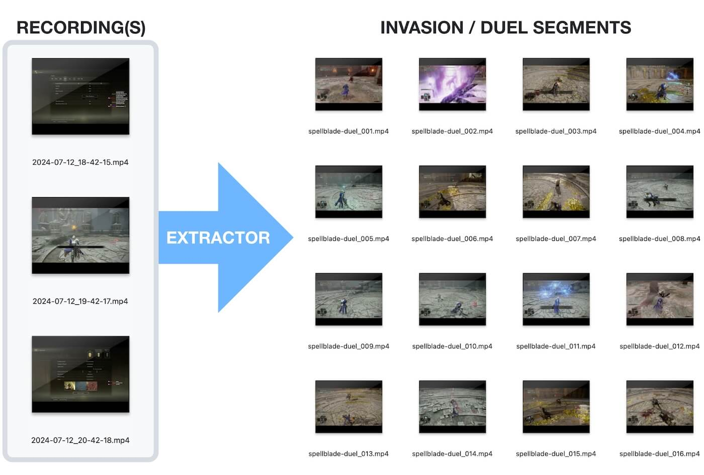

# Elden Ring Invasion Extractor

Automatically detect and extract invasion clips from your Elden Ring gameplay footage. This Ruby gem scans your recordings using OCR (Optical Character Recognition) to find invasion start/end points and cuts them into separate video files—perfect for content creators who want to streamline their editing workflow.

[📺 Watch the demo](https://www.youtube.com/watch?v=-G9ARNrhMOI)



---

## Quick Start

Just want to extract some invasions? Here's everything you need:

### Prerequisites

Make sure you have **ffmpeg** and **tesseract** installed:

```bash
# macOS
brew install ffmpeg tesseract

# Ubuntu/Debian  
sudo apt-get install ffmpeg tesseract-ocr

# Arch Linux
sudo pacman -S ffmpeg tesseract tesseract-data-eng
```

### Installation

```bash
git clone https://github.com/bladeofmaya/invasion_extractor.git
cd invasion_extractor
bundle install
```

### Basic Usage

```bash
# Extract invasions from a single video
bin/invasion_extractor video.mp4

# Extract with custom prefix and output directory
bin/invasion_extractor --prefix ps-daggers-tt-04 --outdir ~/Videos/ER/clips ~/Videos/Capture/*.mp4

# Scan only - find invasions without extracting
bin/invasion_extractor scan ~/Videos/Capture/*.mp4
```

**Output:**
```
~/Videos/ER/clips/
├── ps-daggers-tt-04_00001.mp4
├── ps-daggers-tt-04_00002.mp4
├── ps-daggers-tt-04_00003.mp4
└── ...
```

**Pro tip:** If OBS splits your recordings into segments (e.g., 60-minute chunks), pass all files in order. The tool detects invasions that span across files and combines them automatically.

---

## What It Does

This tool reads on-screen text to detect:
- **Invasion Start**: "Invading another world" / "Defeat [Name], Host of Fingers"
- **Invasion End**: "Returning to your world" / "Host of Fingers defeated"
- **Arena Duels**: "Commencing combat" / "Combat ends"

It then automatically cuts your video into individual invasion clips, adding a 10-second buffer before the start and 7.5 seconds after the end so you don't miss any action.

---

## Full CLI Reference

### Command Structure

```
bin/invasion_extractor [COMMAND] [OPTIONS] [VIDEO_FILES...]
```

### Commands

| Command | Description |
|---------|-------------|
| `extract` | Extract invasion clips (default) |
| `scan` | Scan videos and show timestamps only |
| `status` | Show session status and resume info |
| `cache` | Manage OCR cache (sub-commands: `list`, `clear`, `stats`) |
| `benchmark` | Run performance benchmarks |

### Complete Flag Reference

| Flag | Default | Scope | Description |
|------|---------|-------|-------------|
| `-h, --help` | — | Global | Show help message and exit |
| `-v, --version` | — | Global | Show version and exit |
| `-d, --debug` | Off | Global | Print debug output including stack traces on errors |
| `-q, --quiet` | Off | Global | Suppress all non-error output |
| `--show-cache` | — | Global | Display cache statistics (location, entries, sizes) and exit |
| `--clear-cache` | — | Global | Clear all OCR cache files before processing |
| `-p, --prefix PREFIX` | `invasion` | Extract/Scan | Prefix for output clip filenames (e.g., `ps-daggers-tt-04_00001.mp4`) |
| `-o, --outdir DIRECTORY` | `./invasion_clips` | Extract/Scan | Output directory for extracted clips |
| `-j, --jobs N` | `Etc.nprocessors` | Extract/Scan | Number of parallel jobs for OCR processing |
| `--fps RATE` | `2` | Extract/Scan | Frames per second to extract for OCR. Higher = more accurate but slower |
| `--ocr-provider NAME` | `tesseract` | Extract/Scan/Benchmark | OCR engine: `tesseract` (default), `easyocr`, `ollama` |
| `--use-gpu` | Off | Extract/Scan/Benchmark | Enable GPU-accelerated frame extraction (auto-detects NVIDIA/AMD/Intel) |
| `--no-cache` | Off | Extract/Scan | Skip OCR cache and force re-processing of all frames |
| `--filter` | Off | Extract/Scan | Enable frame pre-filtering. Skips empty/dark frames before OCR to speed up processing |
| `--save-frames` | Off | Extract/Scan | Preserve extracted frame images to `~/.invasion_extractor/cache/frames/` for debugging |
| `--resume SESSION` | — | Extract/Scan | Resume from a previously saved session ID |
| `--save-session NAME` | — | Extract/Scan/Status | Save session state under this name for later resuming |
| `--no-progress` | Off | Extract/Scan | Disable progress bars (useful for CI/logs) |
| `--pad-start SECONDS` | `10.0` | Extract/Scan | Seconds to include before invasion start timestamp |
| `--pad-end SECONDS` | `7.5` | Extract/Scan | Seconds to include after invasion end timestamp |
| `--start-pattern REGEX` | Built-in | Extract/Scan | Custom regex for invasion start detection |
| `--end-pattern REGEX` | Built-in | Extract/Scan | Custom regex for invasion end detection |
| `--benchmark` | Off | Extract/Scan | Enable timing benchmarks for each processing stage |
| `--profile [TYPE]` | `all` | Extract/Scan/Benchmark | Profile type: `memory`, `cpu`, or `all` |
| `--benchmark-output FILE` | — | Extract/Scan/Benchmark | Save benchmark report to a JSON file |
| `-c, --config FILE` | — | Extract/Scan | Load configuration from a YAML file |
| `--continue-on-error` | Off | Extract/Scan | Continue processing remaining videos if one fails |
| `--save-session NAME` | — | Status | Show detailed status for a specific session |
| `--ocr-provider NAME` | `tesseract` | Benchmark | OCR provider to benchmark |

### Flag Details

**`--fps RATE`** — Controls how many frames per second are extracted from the video for OCR. The default `2` means one frame every 0.5 seconds. Increasing to `4` or `5` improves detection accuracy for very short invasions but increases processing time linearly. Decreasing to `1` speeds things up but may miss brief text flashes.

**`--ocr-provider NAME`** — Selects the OCR engine:
- `tesseract` — Default. Fast on CPU (~0.3-0.5s/frame), no external dependencies beyond the binary.
- `easyocr` — Python-based, supports GPU. Requires `pip install easyocr`.
- `ollama` — Vision LLM (e.g., `llava:7b`). Requires a running Ollama server. Slower but more accurate on variable text positions.

**`--use-gpu`** — Automatically detects available GPU (NVIDIA via CUDA, AMD/Intel via VAAPI) and uses hardware-accelerated frame decoding. Falls back to CPU if GPU extraction fails. Only accelerates frame extraction, not OCR itself.

**`--filter`** — Enables a frame pre-filter that skips obviously empty or UI-overlay frames before OCR. Uses bright-pixel-ratio and text-band detection tuned for Elden Ring's white-on-black text. Disabled by default because aggressive filtering can miss dim text frames. Useful for speeding up batch processing of long videos.

**`--save-frames`** — Keeps the cropped frame images extracted by ffmpeg in `~/.invasion_extractor/cache/frames/<video-hash>/`. Useful for debugging crop regions or investigating why text wasn't detected. Images are normally deleted after OCR.

**`--show-cache`** / **`--clear-cache`** — Global flags that work with any command. `--show-cache` prints cache location, entry count, total size, and lists all cached files. `--clear-cache` deletes all cached OCR data before running the command.

---

## Usage Examples

### Basic Extraction

```bash
# Extract from a single video
bin/invasion_extractor video.mp4

# Extract from multiple videos with prefix
bin/invasion_extractor --prefix my-invasions ~/Videos/Capture/*.mp4

# Specify output directory
bin/invasion_extractor -o ~/Desktop/clips ~/Videos/Capture/*.mp4
```

### Scan Mode (Preview Invasions)

```bash
# Scan only - shows timestamps without extracting
bin/invasion_extractor scan ~/Videos/Capture/*.mp4

# Output:
# Detected Invasions:
#   [1] 00:05:30.000 → 00:08:45.500
#       File: 2024-01-15_18-39-00.mp4
#   [2] 00:22:15.000 → 00:25:30.250
#       Cross-file: 2024-01-15_18-39-00.mp4 → 2024-01-15_19-39-00.mp4
# 
# Total: 2 invasion(s) detected
```

### Resume Long Sessions

When processing many large video files, sessions can take hours. The resume feature allows you to stop and continue later:

```bash
# Start a session with a name
bin/invasion_extractor extract --save-session stream-001 ~/Videos/Capture/*.mp4

# ... processing starts, progress bar shows ...
# Press Ctrl+C to interrupt

# Later, resume where you left off
bin/invasion_extractor extract --resume stream-001 --save-session stream-001 ~/Videos/Capture/*.mp4

# Check status of a session
bin/invasion_extractor status --save-session stream-001

# List all sessions
bin/invasion_extractor status
```

### Performance Benchmarking

```bash
# Basic benchmark
bin/invasion_extractor extract --benchmark ~/Videos/Capture/video.mp4

# Full profiling with report
bin/invasion_extractor extract --benchmark --profile all --benchmark-output report.json ~/Videos/Capture/*.mp4

# Benchmark different OCR providers
bin/invasion_extractor benchmark --ocr-provider tesseract ~/Videos/Capture/video.mp4
bin/invasion_extractor benchmark --ocr-provider easyocr ~/Videos/Capture/video.mp4
```

### GPU Acceleration

```bash
# Use GPU for frame extraction
bin/invasion_extractor extract --use-gpu ~/Videos/Capture/*.mp4

# GPU with EasyOCR (if you have GPU-enabled EasyOCR installed)
bin/invasion_extractor extract --use-gpu --ocr-provider easyocr ~/Videos/Capture/*.mp4
```

### Cache Management

```bash
# View cache statistics
bin/invasion_extractor cache stats

# List cached entries
bin/invasion_extractor cache list

# Clear all cached OCR data
bin/invasion_extractor cache clear
```

### Cache Inspection & Clearing (Global Flags)

```bash
# Show cache info from anywhere
bin/invasion_extractor --show-cache

# Clear cache before extracting (forces re-processing)
bin/invasion_extractor --clear-cache ~/Videos/Capture/*.mp4

# Clear cache before scanning
bin/invasion_extractor scan --clear-cache ~/Videos/Capture/*.mp4
```

### Frame Filtering & Debugging

```bash
# Enable frame filtering for faster processing on long videos
bin/invasion_extractor extract --filter ~/Videos/Capture/*.mp4

# Save extracted frames to debug crop regions or OCR issues
bin/invasion_extractor extract --save-frames ~/Videos/Capture/*.mp4
# Frames are saved to ~/.invasion_extractor/cache/frames/<video-hash>/

# Combine: filter + save frames for analysis
bin/invasion_extractor extract --filter --save-frames ~/Videos/Capture/*.mp4
```

### Custom Detection Patterns

```bash
# Custom patterns for different languages or UI mods
bin/invasion_extractor extract \
  --start-pattern "Invadindo.*mundo" \
  --end-pattern "Retornando.*mundo" \
  ~/Videos/Capture/*.mp4
```

---

## Requirements & Compatibility

| Requirement | Details |
|------------|---------|
| **Resolution** | Optimized for 1440p (2560×1440), works at 1080p and 720p |
| **Framerate** | 30fps or 60fps |
| **Platform** | macOS (tested), Linux & Windows should work |
| **Language** | English only (for now) |
| **Ruby** | 3.0+ |

### Known Limitations

- **UI Overlays**: PSN quick menu or other overlays covering game text can cause missed detections. The `--filter` flag may skip UI-overlay frames but can also skip dim text frames.
- **Text Position**: Invasion text must be visible—if you're in a menu when it appears, detection may fail
- **Performance**: Processing a 60-minute video takes ~30-60 seconds on CPU (GPU acceleration available)
- **Frame Filtering**: The `--filter` flag is experimental. It is disabled by default because aggressive filtering can miss invasion text frames, especially "Returning to your world" which appears on a dark background.

---

## Session & Resume System

The tool automatically maintains state in `~/.invasion_extractor/`:

```
~/.invasion_extractor/
├── cache/           # OCR results cache
│   ├── video1-abc123.yml
│   └── video2-def456.yml
└── sessions/        # Processing sessions
    ├── 20260117-143052-a1b2.json
    └── stream-001.json
```

Sessions track:
- Video processing status (pending/completed/error)
- Frame processing counts
- Detected invasions with timestamps
- Clip extraction queue
- Resume capability for interrupted jobs

---

## Performance Tips

1. **Use cache**: Already-processed videos are skipped automatically
2. **Enable GPU**: `--use-gpu` for 2-3x faster frame extraction
3. **Resume long jobs**: Use `--save-session` for multi-hour extractions
4. **Parallel jobs**: Adjust `-j` flag based on your CPU cores
5. **Lower FPS**: For faster (but less accurate) scanning, use `--fps 1`
6. **Frame filtering**: `--filter` skips empty frames before OCR, saving 20-40% processing time on videos with lots of downtime
7. **Save frames for debugging**: `--save-frames` preserves cropped images to inspect why text wasn't detected

---

## Development

Want to hack on this or add new features? Here's the technical overview.

### Architecture

The codebase follows SOLID principles with Strategy pattern for OCR providers and Command pattern for CLI:

```
lib/invasion_extractor/
├── cli.rb                         # CLI orchestrator (parses args, dispatches commands)
├── commands/
│   ├── base.rb                    # Abstract command base class
│   ├── extract.rb                 # Extract/scan command implementation
│   ├── status.rb                  # Session status command
│   ├── cache.rb                   # Cache management command
│   └── benchmark.rb               # Benchmark command
├── ocr/
│   ├── provider.rb                # Abstract OCR interface
│   ├── tesseract_provider.rb      # Tesseract implementation (default)
│   ├── easyocr_provider.rb        # EasyOCR implementation
│   └── ollama_provider.rb         # Vision LLM implementation (experimental)
├── frame_filter.rb                # Frame pre-filter (bright-pixel + text-band detection)
├── session.rb                     # Session state management
├── session_store.rb               # Session persistence
├── benchmark_runner.rb            # Performance profiling
├── progress_reporter.rb           # CLI progress display
├── engine.rb                      # Main orchestration
├── video.rb                       # Video file representation
├── ocr_worker.rb                  # Frame extraction & OCR processing
├── scanner.rb                     # Pattern matching for invasion detection
└── clip.rb                        # Video clip generation
```

### Data Flow with Sessions

```
Video Files → Session Init → OCR Stage → Scan Stage → Extract Stage
     ↓              ↓              ↓            ↓             ↓
  Validate    Create/Resume   (Parallel)   Detect        (Parallel)
  Existence   State File      per-video    Invasions      clip cuts
```

### Running Tests

```bash
bundle exec rake test
```

All tests run against sample video files in `test/samples/`.

### Using Different OCR Providers

```ruby
# Using Tesseract (default)
provider = InvasionExtractor::OCR::TesseractProvider.new
engine = InvasionExtractor::Engine.new(["video.mp4"], ocr_provider: provider)

# Using EasyOCR (requires easyocr gem)
provider = InvasionExtractor::OCR::EasyOCRProvider.new
engine = InvasionExtractor::Engine.new(["video.mp4"], ocr_provider: provider)

# Using Ollama (requires vision model + GPU)
provider = InvasionExtractor::OCR::OllamaProvider.new(
  model: 'llava:7b',
  host: 'http://localhost:11434'
)
```

See `BENCHMARK_SUMMARY.md` for performance comparisons between providers.

---

## Planned Features

- [x] Automatically detect invasion start and end points
- [x] Support for Arena Duels
- [x] Session-based resume capability
- [x] Progress bars with ETA
- [x] GPU acceleration for frame extraction
- [x] Performance benchmarking
- [x] EasyOCR provider support
- [ ] Multi-language support
- [ ] Support for Taunter's Tongue runs
- [ ] Windows & Linux binaries
- [ ] Real-time processing mode

---

## Contributing

Contributions welcome! Areas that need help:

- **Windows/Linux testing**: Currently only tested on macOS
- **Multi-language support**: Japanese, German, French, etc.
- **OCR accuracy**: Tuning crop regions for better text detection
- **Alternative OCR**: Benchmarking EasyOCR, PaddleOCR, etc.

Open an issue or submit a PR at [github.com/bladeofmaya/invasion_extractor](https://github.com/bladeofmaya/invasion_extractor).

---

## Support

If this tool saves you time, consider supporting development:

[](https://ko-fi.com/bladeofmaya)

## License

MIT License - see [MIT-LICENSE](MIT-LICENSE)

---

*Happy invading! ⚔️*

*For a behind-the-scenes look at how this was built, check out the [creation stream summary](https://www.youtube.com/watch?v=ZAWuatbjIuc).*
